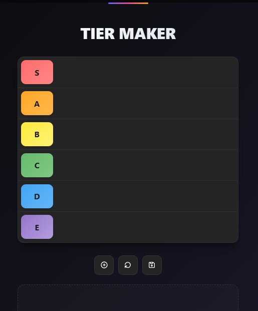
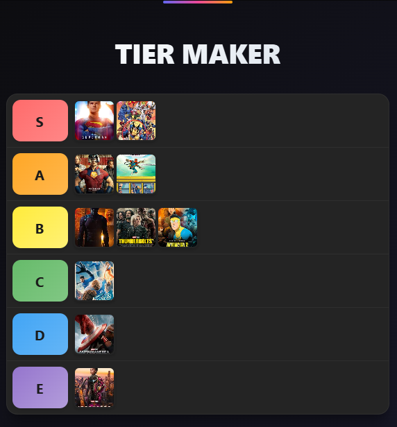

# Tiermaker

Web para crear tier list personalizadas de forma intuitiva y divertida.

## Tabla de Contenidos

- [Características](#características)
- [Capturas de Pantalla](#capturas-de-pantalla)
- [Tecnologías](#tecnologías)
- [Requisitos Previos](#requisitos-previos)
- [Instalación](#instalación)
- [Demo](#demo)
- [Estructura del Proyecto](#estructura-del-proyecto)
- [Funcionalidades](#funcionalidades)
- [Agradecimientos](#agradecimientos)

## Características

- 🎨 Creación de tier lists personalizadas con diferentes categorías
- 📸 Carga de imágenes mediante subida de archivos locales
- 🖱️ Sistema de drag and drop para organizar elementos fácilmente
- 🎨 Personalización de colores y nombres de tiers (S, A, B, C, D, F)
- 💾 Exportación de tier lists como imagen PNG
- 📱 Interfaz responsiva para uso en dispositivos móviles
- ⚡ Rendimiento optimizado sin dependencias externas
- 🔄 Reorganización dinámica de elementos entre tiers
- 🗑️ Eliminación de elementos con un solo clic

## Capturas de Pantalla





## Tecnologías

- **HTML5**: Estructura semántica y moderna
- **CSS3**: Estilos personalizados, Flexbox y Grid Layout
- **JavaScript Vanilla**: Sin frameworks ni librerías externas
- **Drag and Drop API**: API nativa de HTML5
- **Canvas API**: Para exportación de imágenes
- **LocalStorage API**: Almacenamiento local del navegador
- **File API**: Para carga de imágenes locales

## Requisitos Previos

Antes de comenzar, asegúrate de tener:

- Navegador web moderno (Chrome, Firefox, Edge, Safari)
- Editor de código (VS Code, Sublime Text, etc.) - opcional
- [Git](https://git-scm.com/) para clonar el repositorio

## Instalación

Sigue estos pasos para instalar y ejecutar el proyecto localmente:

1. **Clona el repositorio**
```bash
git clone https://github.com/brayanhl17/Tiermaker.git
```

2. **Navega al directorio del proyecto**
```bash
cd Tiermaker
```

3. **Abre el proyecto**

Opción 1 - Abrir directamente:
```bash
# Abre index.html en tu navegador
# Doble clic en el archivo o arrastra a tu navegador
```

Opción 2 - Usar Live Server (VS Code):
```bash
# Instala la extensión Live Server en VS Code
# Clic derecho en index.html > Open with Live Server
```


4. **Accede a la aplicación**
```
http://localhost:8000
# o simplemente abriendo index.html directamente
```

## Demo

Prueba la aplicación en vivo sin necesidad de instalar nada:

🔗 **[Ver Demo en Vivo](https://brayanhl17.github.io/Tiermaker)**

La demo incluye todas las funcionalidades:
- ✨ Crear tier lists desde cero
- 🖼️ Subir tus propias imágenes
- 🎨 Personalizar colores y nombres de tiers
- 💾 Exportar tu tier list como imagen
- 📱 Interfaz responsiva para móviles y tablets

## Estructura del Proyecto

```
Tiermaker/
│
├── index.html            # Página principal
│
├── css/
│   ├── styles.css        # Estilos principales
│
├── js/
│   ├── script.js           # Lógica principal
│
└── README.md             # Este archivo
```

## Funcionalidades

### Creación de Tier Lists
- Interfaz intuitiva para crear listas de clasificación
- Añadir elementos mediante URL de imagen
- Subir imágenes desde el dispositivo local
- Organizar elementos arrastrando y soltando
- Vista previa en tiempo real

### Personalización de Tiers
- Editar nombres de cada tier (S, A, B, C, D, F)
- Personalizar colores de fondo de cada tier
- Añadir o eliminar tiers según necesidad
- Ajustar tamaño de elementos
- Reordenar tiers verticalmente

### Gestión de Elementos
- Panel lateral con todos los elementos disponibles
- Arrastrar elementos entre tiers usando HTML5 Drag and Drop
- Arrastrar elementos de vuelta al panel
- Eliminar elementos individuales
- Agregar múltiples elementos a la vez

### Exportación y Guardado
- Exportar tier list como imagen PNG de alta calidad usando Canvas API
- Guardar tier lists en el navegador (LocalStorage)
- Cargar tier lists guardadas previamente
- Descargar imagen directamente al dispositivo
- Persistencia de datos entre sesiones

### Características Adicionales
- Interfaz completamente responsiva
- Sin dependencias externas ni frameworks
- Funciona sin conexión a internet (después de la primera carga)
- Ligero y rápido
- Compatible con todos los navegadores modernos

## Agradecimientos

- A TierMaker.com por la inspiración del concepto
- A Midudev, creador de contenido 
---
